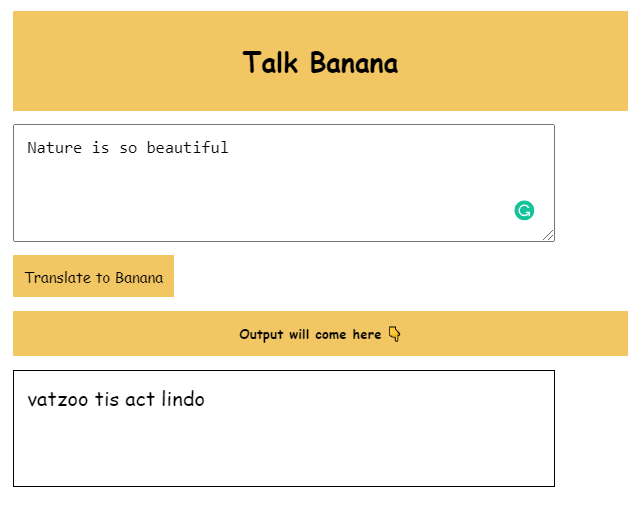

# neog-camp--Banana-Speak

### Features:
Created using Javascript,HTML,CSS

-   Taking Input from users and convert it into Banana language
-   Shows converted text to user

### Methods used

-   queryselector: for taking input Id from user .
-   addEventListener: To perform some operation after clicking on button.

### Snapshot

### Thanks for going through my project please reach out to me on twitter if you want to give any feedback

